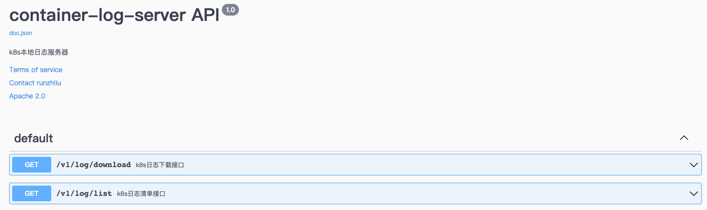

# container-log-server

## Overview

User always wants to obtain the logs in the container even after the container exits, unfortunately, as the default settings for K8S cluster, the logs of the pod/containers would be clean soon after the container exit.

The purpose of this project is to provide users with an interface to download log files. Of course, the premise is that the log of the container needs to be persisted locally, which can be done by `hostpath` or other methods.

Two components:

1. file-server-ds: Deploy on worker nodes and mount the container's log directory
2. container-log-server: Provides the RESTful API for listing and downloading log files

```ascii
                     ┌──────────────────────────┐
                     │host3                     │
                     │  ┌────────────────────┐  │
                     │  │container-log-server│  │
                     │  └─────────┬──────────┘  │
                     └────────────┼─────────────┘
                                  │
         ┌────────────────────┐   │    ┌───────────────────┐
         │host1               │   │    │host2              │
         │  ┌──────────────┐  │   │    │ ┌──────────────┐  │
         │  │file-server-ds│  ┼───┴────┼ │file-server-ds│  │
         │  └─────┬────────┘  │        │ └──────┬───────┘  │
         │        │ mount     │        │        │ mount    │
         │        ▼           │        │        ▼          │
         │  /var/log/docker/  │        │  /var/log/docker  │
         └────────────────────┘        └───────────────────┘
```

## Helm deploy

Two parts for deployments

```shell
helm install container-log-server --createnamespace --namespace log .
```

## Example

swagger docs



list logs


