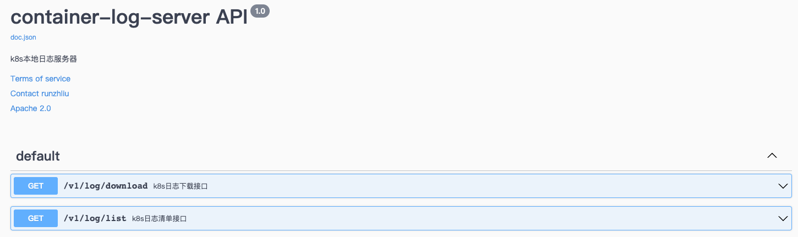
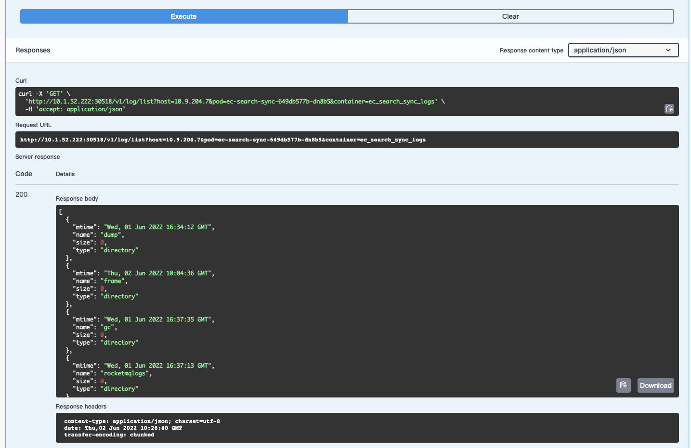

# container-log-server

## Overview

需求是当容器退出后，在一定的窗口期内，用户还可以通过某些方法拿到容器内的文件，这里主要是针对日志，当平台允许用户将日志写到宿主机的指定的目录的时候，container-log-server 就可以支持用户通过 HTTP 接口去获取日志

## 分析

在目前的业务场景下，用户会将日志打到容器本地，不管日志文件是否有落到某种类型的卷中，同时由于日志采集的链路以及容量的问题，存在一些场景是用户希望可以用某些方法，在容器被 `kill` 或者重启后可以拿到原来的容器内的日志文件

通过获取原来 Pod 部署在哪个 Host，获取指定 IP 某个指定目录的工作负载中的日志文件。

主要分为两个组件

1. file-server-ds: 部署在工作节点上，并且挂载容器的日志目录
2. container-log-server: 提供下载日志文件的接口

```ascii
                     ┌──────────────────────────┐
                     │host3                     │
                     │  ┌────────────────────┐  │
                     │  │container-log-server│  │
                     │  └─────────┬──────────┘  │
                     └────────────┼─────────────┘
                                  │
         ┌────────────────────┐   │    ┌───────────────────┐
         │host1               │   │    │host2              │
         │  ┌──────────────┐  │   │    │ ┌──────────────┐  │
         │  │file-server-ds│  ┼───┴────┼ │file-server-ds│  │
         │  └─────┬────────┘  │        │ └──────┬───────┘  │
         │        │ mount     │        │        │ mount    │
         │        ▼           │        │        ▼          │
         │  /var/log/docker/  │        │  /var/log/docker  │
         └────────────────────┘        └───────────────────┘
```


## 计划的方案

需要结合平台的运营的可运营性和用户使用的易用性考虑，前者是为了合理的清理母机的空间，后者是方便用户的使用

1. 通过webhook给业务Pod注入Volume/VolumeMount，以hostpath给用户提供日志存储的目录
2. 宿主机对应的目录必须固定且与系统根目录隔离，目录以namespace-workload-pod命令，提供定时删除的Job作为管理
3. 通过webhook注入LOG_PATH环境变量，提供已经挂载好的容器内目录作为默认的日志地址
4. 集群中部署container-log-server(DaemonSet)，用户可以根据Pod的属性host/workload/pod/container，通过HTTP协议下载日志文件
5. file-server-ds直接用Nginx容器来部署

## Helm部署

部署主要分为两个部分

```shell
helm install container-log-server --createnamespace --namespace log .
```

## Example

接口文档



日志清单




## TODO

- [x] helm部署
- [ ] 容器内编译